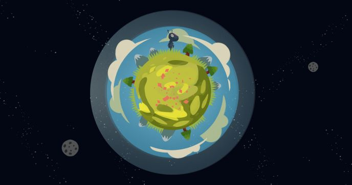
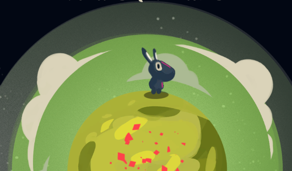

# Planet Hopping

## The game
Planet Hopping is a 2d cartoon-ish procedural planet-exploration game. It was developed in Pisa (Italy) as a 2019 Global Game Jam entry.  

You exploited your planet, and now you have to flee away, looking for a new home.  
The theme was "What home means to you" and we decided to create a game where the player loses his/her planet and must collect every pieces of it exploring the entire universe. Each new world the player visits is procedurally generated.

## Images
|||
|:---:|:---:|
| ||

# Download
Download the game build here! [Windows (x64)](./Build.rar)

# Developer team
|Name|Role|GitHub profile|
|:---:|:---:|:---|
| Nicolò Renzoni | Programmer | [github.com/KlausRenzo](https://www.github.com/klausrenzo) |
| Gianni Vallerini | Programmer | [github.com/Gianni173](https://github.com/gianni173) |
| Samuele Bandini | Artist | [github.com/SamueleBandini](https://github.com/SamueleBandini) |
| Nicholas Comparoni | Game Designer | [github.com/NicholasComparoni](https://github.com/NicholasComparoni) |
| Francesco Gasperini  | Game Designer |  |